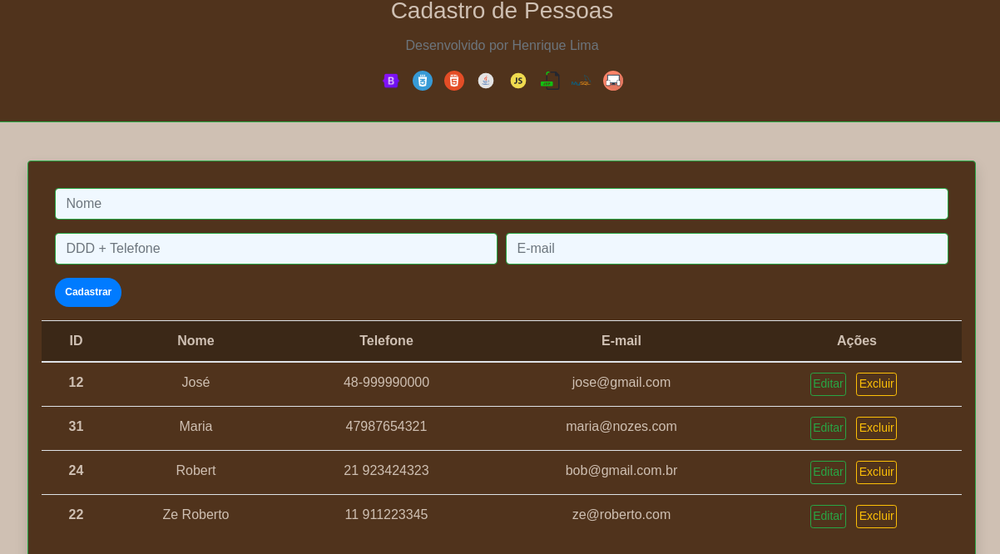
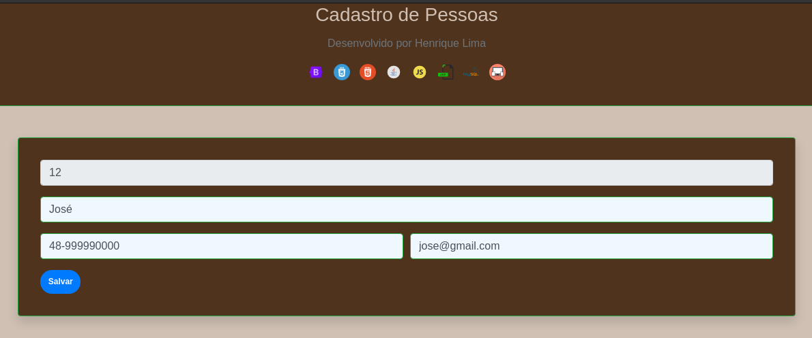

<h1 align="center">
    Cadastro de Pessoas
</h1>

<h4 align="center">
	 CRUD em Java com DB MySql 🚀
</h4>

## 💻 Sobre o projeto

🚧  Este é um projeto feito em Java com MysQl, é um simples cadastro de pessoa, a famoso CRUD. Falta alguns ajustes para serem feitos, que conforme forem ocorrendo, vou atualizando o projeto.

# Falta Finalizar

<li> Páginação do resultado de cadastros</li>
<li> Validação do número de telefone e E-mail</li>
<li> ajustar 100% o layout responsivo</li>


---

## 🎨 Layout

Para criar o layout do projeto foi usado CSS3, HTML5 e BOOSTRAP


  

  

  
  
  


---
## Alguns prints

<p></p>

<p></p>



#### 🎲 MySql (Banco de Dados)


Download do Conector MySql
https://dev.mysql.com/downloads/connector/j/ <br>
Faça o download conforme seu SO e a versão do MySql e coloque na pasta WebContent/WEB-INF/lib


```bash

# Tabela do DB

 CREATE TABLE `contatos` (
  `id` int NOT NULL AUTO_INCREMENT,
  `nome` varchar(80) NOT NULL,
  `fone` varchar(15) NOT NULL,
  `email` varchar(50) DEFAULT NULL,
  PRIMARY KEY (`id`)
)

```


---


## 💪 Como contribuir para o projeto

1. Faça um **fork** do projeto.
2. Crie uma nova branch com as suas alterações: `git checkout -b my-feature`
3. Salve as alterações e crie uma mensagem de commit contando o que você fez: `git commit -m "feature: My new feature"`
4. Envie as suas alterações: `git push origin my-feature`
> Caso tenha alguma dúvida confira este [guia de como contribuir no GitHub](./CONTRIBUTING.md)

---

## 🦸 Autor

<a href="https://www.linkedin.com/in/henrique-correa-de-lima-2455b7a6/">
 
 <br />
 <sub><b>Henrique lima</b></sub></a> <a href="https://www.linkedin.com/in/henrique-correa-de-lima-2455b7a6/" title="Henrique Lima">🚀</a>
 <br />

[](https://www.linkedin.com/in/henrique-correa-de-lima-2455b7a6/)
[](mailto:henriquehcl@hotmail.com)

---

## 📝 Licença

Este projeto esta sobe a licença [MIT](./LICENSE).

Feito com ❤️ por Henrique Lima 👋🏽 [Entre em contato!](https://www.linkedin.com/in/henrique-correa-de-lima-2455b7a6/)

---
